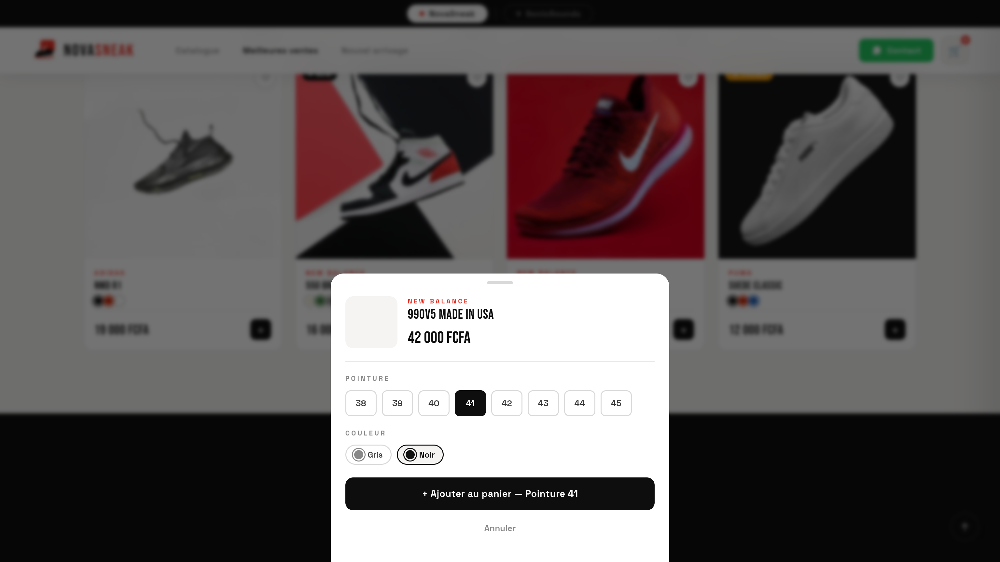
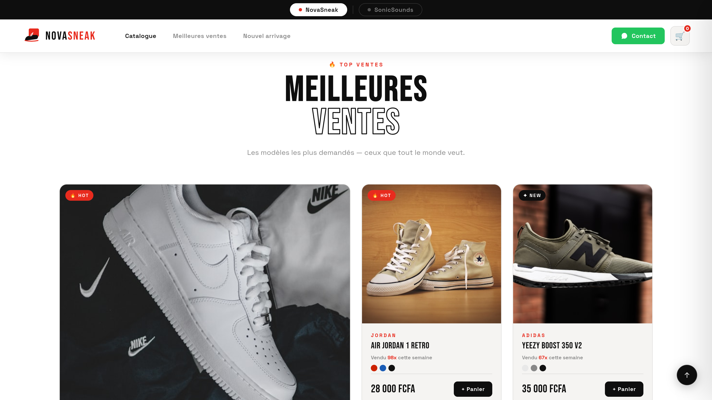
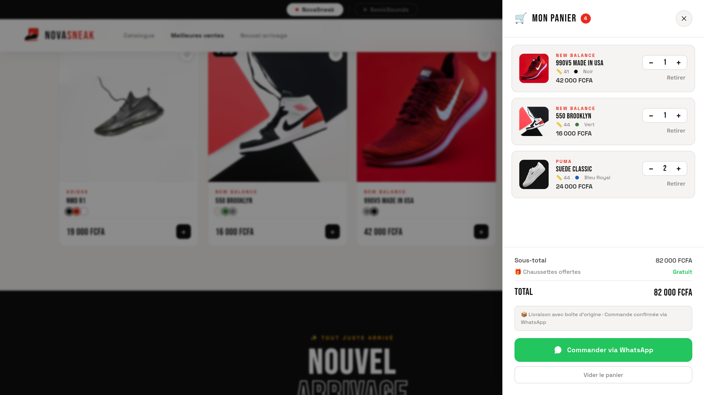

# 🚀 NovaSneak — Sneakers Premium E-commerce

> **MVP d'une boutique de sneakers** avec catalogue produit, panier interactif et commande directe via WhatsApp. Un projet conçu pour offrir une expérience utilisateur fluide et immersive.

🔗 **Dépôt GitHub :** [github.com/AbdelFadel06/novasneak](https://github.com/AbdelFadel06/novasneak)

---

## 📦 Fonctionnalités principales

| Fonctionnalité | Description |
| :--- | :--- |
| 🏠 **Hero Fullscreen** | Carrousel d'images avec transitions fluides et marque dynamique. |
| 🔥 **Meilleures ventes** | Affichage des modèles populaires avec badges "Hot" et compteur de ventes. |
| 🛍️ **Catalogue complet** | Filtrage par marque (Nike, Jordan, Adidas, New Balance, Puma) et par prix. |
| 🎨 **Sélection taille/couleur** | Modal interactif pour choisir pointure et couleur avant d'ajouter au panier. |
| 🛒 **Panier intelligent** | Gestion des quantités, affichage des sélections (taille/couleur), calcul du total. |
| 📱 **Commande WhatsApp** | Génération automatique d'un message de commande avec récapitulatif détaillé. |

---

## 📸 Aperçu

<div align="center">
  <table>
    <tr>
      <td align="center"><strong>🛒 Ajout au panier</strong></td>
      <td align="center"><strong>🔥 Meilleures ventes</strong></td>
      <td align="center"><strong>📦 Panier</strong></td>
    </tr>
    <tr>
      <td align="center"></td>
      <td align="center"></td>
      <td align="center"></td>
    </tr>
  </table>
</div>

---

## 🛠️ Stack technique

| Catégorie | Technologie | Rôle |
| :--- | :--- | :--- |
| **Frontend** | HTML5, CSS3, JavaScript Vanilla | Structure, styles et logique métier |
| **Design System** | CSS Variables, Flexbox, Grid | Mise en page responsive et cohérente |
| **Animations** | CSS Transitions / Keyframes | Carrousel, hover, feedbacks utilisateur |
| **Polices** | Google Fonts (Bebas Neue, Space Grotesk, Inter) | Identité visuelle moderne |
| **Gestion de version** | Git & GitHub | Suivi des modifications |

---

## ⚡ Choix techniques & compromis produit

| Décision | Justification |
| :--- | :--- |
| **MVP en HTML/CSS/JS pur** | Validation rapide de la demande utilisateur avant d'investir sur une stack plus lourde (React prévu en v2). |
| **Pas de backend** | Simplification du prototype ; les commandes passent directement via WhatsApp pour une logistique allégée. |
| **Modal d'ajout au panier** | Expérience utilisateur améliorée : l'utilisateur choisit taille/couleur avant d'ajouter, évitant les erreurs de commande. |

---

## 🚀 Installation & Lancement

```bash
# 1. Cloner le projet
git clone https://github.com/AbdelFadel06/novasneak.git

# 2. Entrer dans le dossier
cd novasneak

# 3. Ouvrir le fichier index.html dans votre navigateur
